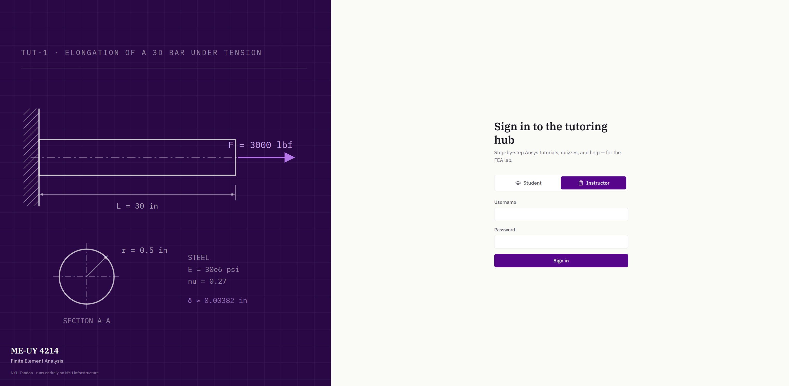

# Ansys Tutoring System — ME-UY 4214

An AI-assisted overlay that guides students step-by-step through Ansys tutorials, live, on top of the real application.


Built for NYU's ME-UY 4214 (Finite Element Analysis lab) as part of an AI in Education Seed Grant, with a pilot planned for Fall 2026. A transparent, click-through panel sits on top of Ansys Workbench and Mechanical, highlighting exactly which element to interact with next and walking the student through the tutorial step by step — including the multi-app handoff every tutorial requires: Workbench → Discovery/SpaceClaim (geometry) → back to Workbench → Mechanical (FEA/solve). Each step is confirmed by the student via a "Mark step complete" button rather than automatic detection — see [`spikes/guide_tut1.py`](spikes/guide_tut1.py)'s module docstring for why.

The system is local-first by design: no student interaction data leaves NYU infrastructure, and no cloud LLM ever touches student data.

See [`Student-Track-App-Build-Plan.md`](Student-Track-App-Build-Plan.md) for the build plan and [`CLAUDE.md`](CLAUDE.md) for project conventions and architecture pointers.

## The Tutoring Hub (web app)



Alongside the desktop overlay, the repo now ships a full-stack **hub** — FastAPI + SQLite backend (`server/`) and a React SPA (`webapp/`) — that runs on the instructor desktop and serves the whole class over the NYU LAN. Everything is local: bundled fonts, no CDN, no cloud LLM, and every analytics row carries an opaque `student_xxxxxx` token instead of a name or NetID.

What works today:

- **Auth** — instructors are seeded accounts; students self-register with a per-section **class code** (`SEC-XXXXXX`) plus a display name and password.
- **Student side** — tutorial dashboard with per-step progress, an in-browser tutorial runner with live tick marks, one-click **Launch/Close desktop guide** buttons (via the `ansysguide://` URL protocol), report upload with instant rubric feedback, post-tutorial **quizzes** (per-question explanations, by-concept results), and **Compass** — a streaming chat assistant over locally indexed Ansys docs with cited sources and an explicit consent gate.
- **Instructor side** — section management with regenerable class codes (progress dashboards, tutorial library, quiz analytics, and the FAQ review queue are in progress).

### Run the hub

```powershell
# one-time: install server deps + build the web UI (Node 20+)
.venv\Scripts\pip install fastapi uvicorn bcrypt python-multipart
cd webapp; npm install; npm run build; cd ..

# start (the first boot seeds the instructor account and imports tut1 + its quiz)
$env:INSTRUCTOR_USERNAME = 'prof'
$env:INSTRUCTOR_PASSWORD = '<pick-a-password>'
.venv\Scripts\python -m uvicorn server.app:app --port 8000
```

Then open **http://localhost:8000**:

1. Sign in as the instructor → **Class** → create a section → share its class code.
2. Students register with that code, open Tutorial 1 from their dashboard, and either run it in the browser or click **Launch desktop guide**.
3. Compass (the chat assistant) additionally needs [Ollama](https://ollama.com) running locally and the `chatbot_spike/` index built — see [`chatbot_spike/README.md`](chatbot_spike/README.md). Without it, chat degrades gracefully; everything else works.
4. The **Launch desktop guide** button needs a one-time, per-PC registration (no admin rights):
   `.venv\Scripts\python tools\register_guide_protocol.py` (`--unregister` reverses it).

Quizzes are JSON-authored like tutorials: drop a file in `mock_server/data/quizzes/` (see [`tut1_3d_bar.json`](mock_server/data/quizzes/tut1_3d_bar.json)) and restart — no code changes.

Tests (no Ansys or Ollama needed): `.venv\Scripts\python -m pytest tests\server`

## Status

**Desktop overlay** — the Phase 0 spike (`spikes/guide_tut1.py`): a working, manually-driven walkthrough of Tut-1, used to de-risk the real architecture's assumptions before it gets built for real under `student_app/`. It covers Workbench setup through Mechanical's results steps and then a final generated-report upload/validation checkpoint.

**Tutoring Hub** — milestones 1–4 of 6 complete: auth + login, the full student content slice (dashboard, runner, reports), quizzes, and Compass chat. In progress: instructor dashboards/library (M5), then quiz analytics + the FAQ mining pipeline (M6).

Tutorials are **JSON-only**: the guide runs any tutorial file in `mock_server/data/` with no code changes. Which steps run, and in what order, comes from the tutorial JSON itself (its optional `runtime_steps` list), and the report-upload checkpoint appears whenever the tutorial declares a `report_checks` rubric.

## How to use the desktop guide

1. **Install dependencies** (Python 3.11+, Windows):
   ```
   pip install pywinauto pyqt6 opencv-python-headless numpy pillow pytesseract
   ```
   You'll also need the [Tesseract OCR](https://github.com/tesseract-ocr/tesseract) binary installed system-wide (used to read on-screen text Ansys doesn't expose via UI Automation), plus an English language file at `spikes/tessdata/eng.traineddata` — see that folder if it's missing.

2. **Open Ansys Workbench** (2025 R2) — either have it already open, or be ready to open it as soon as the guide starts, since step 1 walks you through launching it.

3. **Run the guide**:
   ```
   .venv\Scripts\python spikes\guide_tut1.py            # runs Tut-1 (the default)
   .venv\Scripts\python spikes\guide_tut1.py <tutorial>  # any other tutorial, by id or path
   ```
   A dark panel appears in the top-right corner of your screen, on top of Ansys.

4. **Follow each step:**
   - Read the instruction and hint text in the panel.
   - If a red box appears on screen, that's the live-highlighted element for this step — wherever the box is, that's what to click/interact with next.
   - Some steps (e.g. picking a 3D face in the geometry viewport) show a reference screenshot instead of a live box, since there's nothing to highlight via automation there.
   - Perform the action in the real Ansys window.
   - Click **"✓ Mark step complete"** once you've done it, then **"Next →"** to advance. Use **"← Prev"** to go back.

5. The guide walks you all the way from opening Workbench through generating and saving the final FEA result in Mechanical.

**Note:** the guide is the only thing you run directly — `mock_server/` (a FastAPI stand-in for the real Tutorials & Quizzes server) isn't needed for this spike; `guide_tut1.py` reads the tutorial JSON straight off disk.

## Authoring a new tutorial

No code changes needed — a tutorial is one JSON file:

1. Copy [`mock_server/data/_template.json`](mock_server/data/_template.json) to `mock_server/data/<tutorial_id>.json` and fill it in (the template's inline `_comment` keys explain each step pattern; [`tut1.json`](mock_server/data/tut1.json) is a full real example).
2. Check it: `.venv\Scripts\python tools\validate_tutorial.py mock_server\data\<file>.json` — must report 0 errors.
3. Run it: `.venv\Scripts\python spikes\guide_tut1.py <tutorial_id>`

Full guidance (selector/highlight decision table, verify types, report rubric, conventions): [`mock_server/data/README.md`](mock_server/data/README.md).
