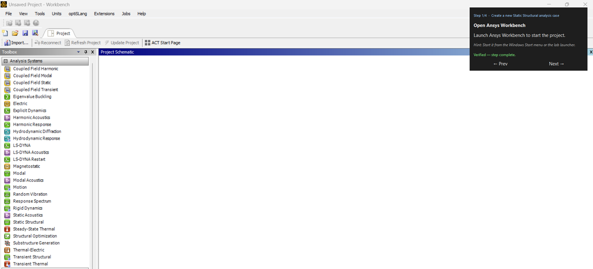

# Ansys Tutoring System — ME-UY 4214

An AI-assisted overlay that guides students step-by-step through Ansys tutorials, live, on top of the real application.

Built for NYU's ME-UY 4214 (Finite Element Analysis lab) as part of an AI in Education Seed Grant, with a pilot planned for Fall 2026. A transparent, click-through panel sits on top of Ansys Workbench, Discovery, and Mechanical, highlighting exactly which element to interact with next, watching the live application state to confirm each step was actually completed (not just clicked), and automatically advancing the student through the tutorial — including the multi-app handoff every tutorial requires: Workbench → Discovery (geometry) → back to Workbench → Mechanical (FEA/solve).

The system is local-first by design: no student interaction data leaves NYU infrastructure, and no cloud LLM ever touches student data.

See [`Student-Track-App-Build-Plan.md`](Student-Track-App-Build-Plan.md) for the build plan and [`CLAUDE.md`](CLAUDE.md) for project conventions and architecture pointers.
