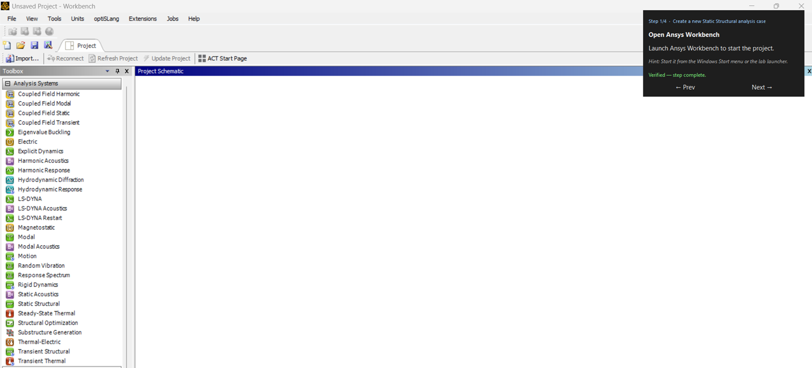
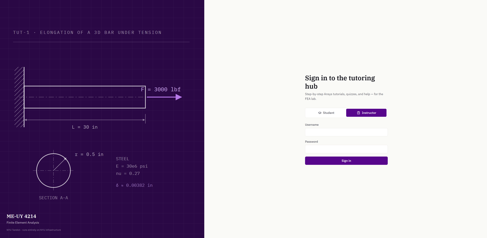

# Ansys Tutoring System — ME-UY 4214

Guides students step by step through Ansys tutorials, live, on top of the real
application.



Built for NYU's ME-UY 4214 (Finite Element Analysis lab). Two parts:

- **Tutoring Hub** — a web app (FastAPI + SQLite, React SPA) the instructor runs for the
  class: tutorials and quizzes, per-step progress, lab-report feedback, and dashboards.
- **Desktop guide** — a transparent panel over Ansys Workbench, Discovery and Mechanical
  that highlights what to click next and tracks the handoff between those apps.

Local-first by design: student data stays on NYU infrastructure, and no cloud service is
involved in normal operation.



## Run it locally

```powershell
pip install -r requirements.txt
cd webapp; npm install; npm run build; cd ..

$env:INSTRUCTOR_USERNAME = 'prof'
$env:INSTRUCTOR_PASSWORD = '<pick-a-password>'
.venv\Scripts\python -m uvicorn server.app:app --port 8000
```

Open <http://localhost:8000> and sign in as the instructor. Then **Class → Class list**,
upload a CSV of student emails (Albert's class-list export works as-is), and students can
register with those addresses.

Tests, which need neither Ansys nor a model: `.venv\Scripts\python -m pytest tests`

## Deploy

See [`deploy/DEPLOY-NYU.md`](deploy/DEPLOY-NYU.md) — Docker Compose, nginx and TLS on the
pilot host, including how registration email and the AI features are configured.

## Configuration

| Variable | Default | Effect |
|---|---|---|
| `DATA_DIR` | `server_data/` | Database, uploaded reports and step images |
| `ENABLE_AI` | `0` (off) | Master switch for every AI feature; off means no AI routes exist |
| `SMTP_HOST` | unset | Registration email; unset logs the confirmation link instead |
| `APP_BASE_URL` | `http://127.0.0.1:8000` | Base for emailed links |

## More

- [`content/data/README.md`](content/data/README.md) — authoring tutorials and quizzes
- [`student_app/README.md`](student_app/README.md) — running the desktop guide
- [`CLAUDE.md`](CLAUDE.md) — conventions and architecture pointers
